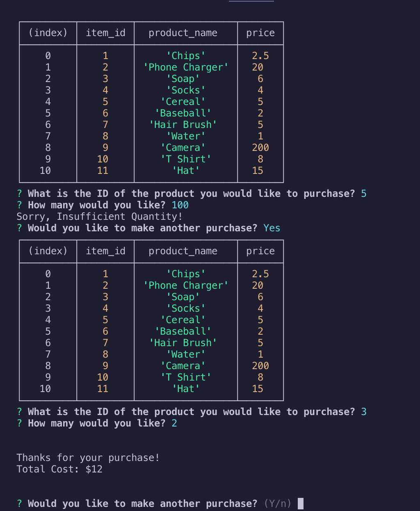
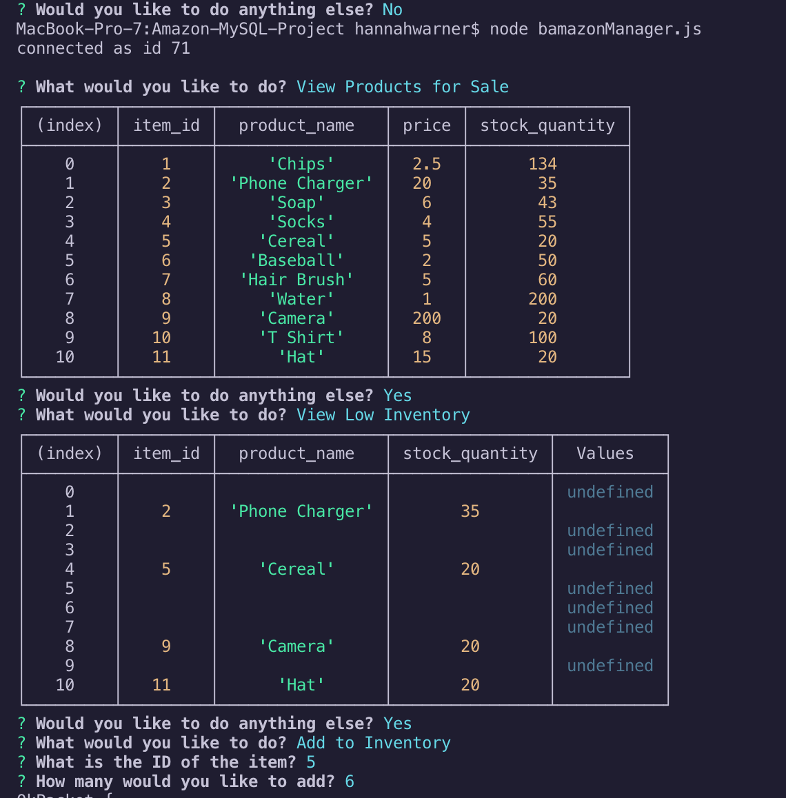

# Amazon-MySQL-Project

Hi there! Thanks for opening my project, are you ready to shop at Amazon?

If you run the / `bamazonCustomer.js` / program, you will be able to perform a variety of functions in order to purchase an item from the Amazon store. 

* to purchase an item, take note of the Item ID number in Column 2

Follow the prompts to successfully complete a purchase.. if there is enough inventory to handle your request. 

If you run the / `bamazonManager.js` / program, you will have access to your inventory in a way that the Customer does not. You will be prompted to select an option from below: 
    *View all items
    *View items with low quantity (Less than 5)
    *Update inventory
    *Add a new product

* to complete any of these tasks, select which option you would like and follow the prompts

This program is useful for managing inventory within a database for a store, similar to Amazon. It automatically updates quantities based on the actions taken on those items. 

To get started, open your Terminal, and type "node" followed by the name of the program in which you would like to run. 

# EXAMPLE IMAGES: 
 

* Created by Hannah Warner as a part of the UCSD Extension Coding Bootcamp

